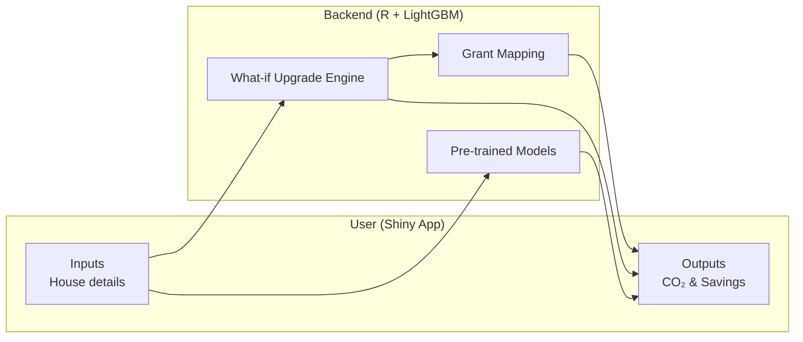

<div align="center">

  

# GreenHomeAI: Predicting Household CO₂ Emissions & Retrofit Upgrades

 
 
 
 


</div>

A research-driven project that uses Irish **BER (Building Energy Rating)** data to **predict household CO₂ emissions** and recommend **retrofit upgrades** (wall insulation, roof insulation, windows, heating).  
The model highlights targeted improvements and estimates **15–30% emission reductions**, aligned with **SEAI grants**.

---

## 📑 Table of Contents
- [Abstract](#-abstract)
- [Project Description](#-project-description)
- [Key Components](#-key-components)
- [Project Goals](#-project-goals)
- [Project Structure](#-project-structure)
- [Installation](#-installation)
- [Usage](#-usage)
- [System Architecture](#-system-architecture)
- [Results](#-results)
- [Future Work](#-future-work)
- [Visuals](#-visuals)
- [Contributors](#-contributors)
- [Contact](#-contact)

---

## 📝 Abstract

Energy retrofits are key to achieving climate targets. This project applies **machine learning (LightGBM)** on Irish BER datasets to predict **household CO₂ emissions** and simulate upgrade scenarios.  
The outputs quantify **emission savings** and show financial eligibility for **SEAI retrofit grants**.

---

## 📌 Project Description

### The Challenge  
Households struggle to identify **which retrofits** save the most energy and qualify for **grants**.  

### Our Solution  
GreenHomeAI:
- Uses **BER datasets** with thousands of Irish homes.  
- Trains **LightGBM regression models** for accurate CO₂ predictions.  
- Performs **what-if upgrade analysis** for walls, roof, windows, and heating.  
- Provides results via an **interactive Shiny app**.  

---

## 🔑 Key Components

- **Data Processing**: Clean and feature-engineer BER datasets (avoid leakage).  
- **ML Models**: Train LightGBM on CO₂ emissions, save pre-trained models.  
- **What-if Analysis**: Simulate retrofit upgrades and compare before/after emissions.  
- **Shiny UI**: Simple user interface for inputting house details and visualizing savings.  
- **Grant Mapping**: Align predicted savings with SEAI grant schemes.  

---

## 🎯 Project Goals

1. Accurately predict CO₂ emissions from BER data.  
2. Simulate **retrofit upgrades** with measurable savings.  
3. Align upgrade outputs with **grant eligibility**.  
4. Build an **interactive tool** usable by policymakers and households.  

---

## 📂 Project Structure

```
greenhomeai/
├── app.R                     # Shiny app entry point
├── README.md                 # Project documentation
│
├── data/                     # Input datasets (<100 MB each)
│   ├── BERmaster2x.csv
│   ├── BERmaster2xreport.csv
│   ├── co2_baseline_aggregated.csv
│   ├── Emission_factors.csv
│   ├── grants_catalog.csv
│   ├── grants_rules.csv
│   ├── Tariffs.csv
│   └── Upgrade_costs.csv
│
├── docs/                     # Documentation and reports
│   ├── poster/
│   │   └── GREENHOMEAI.pdf
│   ├── literature-review/
│   │   └── GreenHome_AI.pdf
│   └── visuals/              # Visual outputs (screenshots, demo)
│       ├── ui_demo.png
│       ├── model_results.png
│       └── savings_plot.png
│
├── models/                   # Saved LightGBM models
│   ├── delta_models/         
│   │   ├── lgb_delta_heating_efficiency.txt
│   │   ├── lgb_delta_insulation_roof.txt
│   │   ├── lgb_delta_insulation_wall.txt
│   │   └── lgb_delta_windows.txt
│   ├── lightgbm_upgrade_friendly.txt
│   ├── lightgbm_upgrade_friendly_meta.rds
│   └── p3_onehot_feature_names.rds
│
├── outputs/                  # CSV results and tables
│   └── tables/
│       ├── delta_models_summary.csv
│       ├── part4_recommendations_long.csv
│       ├── part4_recommendations_top3.csv
│       └── results.csv
│
├── R/                        # Utility scripts
│   ├── CO2MODEL.R
│   ├── DELTACO2MODEL.R
│   ├── featuresR.R
│   ├── mod_inputs_live.R
│   ├── mod_results_live.R
│   ├── utils_live.R
│   └── ... (other helper scripts)
│
├── www/                      # Assets for Shiny
│   ├── styles.css
│   └── logo.png
```

---

## ⚙️ Installation

### Prerequisites
- **R ≥ 4.3.x**
- Packages: `data.table`, `Matrix`, `lightgbm`, `shiny`, `plotly`, `ggplot2`, `dplyr`

### Steps
```bash
# Clone repository
git clone https://github.com/YOUR-USERNAME/greenhomeai.git
cd greenhomeai

# Install R dependencies
R -q -e 'install.packages(c("data.table","Matrix","lightgbm","shiny","plotly","ggplot2","dplyr"))'
```

---

## 🚀 Usage

Run the Shiny app:
```r
shiny::runApp("app.R")
```

Run models directly:
```r
library(data.table)
DT <- fread("data/BERmaster2x.csv")
source("R/CO2MODEL.R")
```

**Example Output**
```
RMSE: 532
MAE : 256
Predicted CO₂: 12345 kg/year
```

---

## 🏗 System Architecture



---

## 📊 Results

| Metric | Value |
|--------|-------|
| RMSE   | 532   |
| MAE    | 256   |
| R²     | 0.976 |

**Example:**  
Wall + Roof insulation upgrades → **~20% reduction in CO₂ emissions**.

---

## 🔮 Future Work

- Integrate **renewable energy sources** (e.g., solar panels, heat pumps) to push houses toward the *greener side*.  
- Add **BER rating improvement estimator** to show post-upgrade rating.  
- Expand **upgrade catalog** (e.g., smart meters, energy-efficient appliances).
- Build a **public dashboard** for policymakers and citizens.  
- Explore **GPT-based advisory system** to provide natural language recommendations to users.

---

## 🖼 Visuals

Here are some visuals to demonstrate the system:  

- **UI Demo**  
  

- **Model Results**  
  

- **Savings Plot**  
  

---

## 👥 Contributors

- **Balpreet Kaur** — Data preprocessing, modeling, documentation  
- **Akshay (Teammate)** — Model training, evaluation, UI integration  

---

## 📬 Contact

- **Project**: GreenHomeAI  
- **Institution**: University College Dublin  
- **Course**: ACM40960 - Mathematical Modelling  
- **Contributors**: Balpreet Kaur, Akshay Musterya
